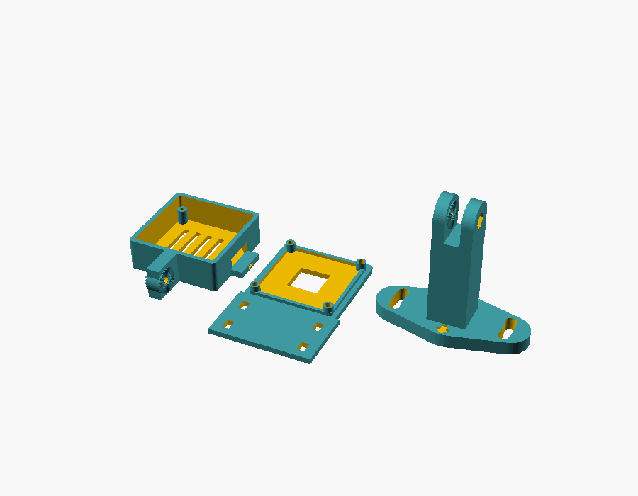

# Camera mounts

Three of these, on the wall around the dartboard, each holding one camera and its light.
The design is for a Winmau Blade 6 on a wall bracket, with the 38 × 38 mm OV9732 USB camera board
(DECXIN-1M-2012V1: M2.5 holes on a 34 mm square, M12 lens).


## Parts (print 3 of each)

| File | What it is | Print orientation |
|---|---|---|
| `stl/case_tub.stl` | back of the camera case: board posts, cable slot, vents, tilt hinge with teeth | as exported (floor down) |
| `stl/case_lid.stl` | front of the case: lens opening, plate above the lens that the LED light is strapped to | as exported (front face down) |
| `stl/wall_arm.stl` | wall plate, column and tilt fork in one piece | as exported (plate down) |



PETG or ASA (PLA slowly sags, and the cameras mustn't move), 4 walls, 40 % infill. No supports needed.

## Hardware per mount

- 4 × M2.5 × 12 mm screws: hold the board, self-tapping into the case posts
- 1 × M3 × 20 mm bolt + nut: tilt hinge (the nut sits in the hex pocket on one prong)
- 2 × pan-head wood screws ~4 × 30 mm, washers and wall plugs
- 2 small cable ties: strap the LED light to the plate above the lens
- 1 cable tie: cable strain relief (loop under the cable slot)

## Assembly

1. Set the lens focus first (turn the lens until the board is sharp at about 30 cm), then put the board in the case
   with its USB connector towards the cable slot.
2. Lid on, 4 × M2.5 screws through the lid and board into the posts.
3. Strap the LED light to the plate above the lens, facing the same way as the lens.
4. Hang the case in the fork with the M3 bolt; leave it loose for now.

## Where to put them

Measure everything from the centre of the bull, along the wall.

- **Distance from the bull:** 300 mm to the centre of each wall plate with the lens that comes with the camera
  (about 68° across). A 2.1 mm M12 lens (about 85° across) can go closer, 260-280 mm.
  The Blade 6's edge is at 225 mm, so the mounts sit just outside the board.
- **Spacing:** evenly round the board, e.g. at 12, 4 and 8 o'clock.
- **Direction:** the arrow on each plate points at the bull. The screw slots let the plate turn 12° either way,
  so fit the screws loosely, point the arrow at the bull (a string from the bull helps), then tighten.
- **Tilt:** about 11° towards the board for 300 mm (13° at 280, 15° at 260). Final adjustment is by eye with the
  camera view open: the whole board, including the far double ring, must be in the picture. Then tighten the M3 bolt;
  the teeth hold it.

## Changing the design

`camera-mount.scad` is OpenSCAD; every size is a setting at the top. The ones you're most likely to change:

- `board_face_from_wall` (default 45 mm): measure how far your board's face sits out from the wall.
- `lens_above_face` (default 40 mm): how far in front of the board face the lens sits.
- `light_plate_h`, `light_plate_w`: size of the plate the LED is strapped to.
- `pcb`, `hole_sp`, `holder`: for a different camera board.

Export a part with, for example:

```sh
openscad -D 'part="wall_arm"' -o stl/wall_arm.stl camera-mount.scad
```

Parts: `case_tub`, `case_lid`, `wall_arm`, `print_all` (all three laid out), `assembly` (preview only).
