# Camera mounts

Three cameras, each with its own small LED light, around the dartboard. Designed for a Winmau Diamond Plus (any standard 451 mm bristle board fits) on its Winmau bracket,
with the 38 × 38 mm OV9732 USB camera board (DECXIN-1M-2012V1: M2.5 holes on a 34 mm square, 13 mm lens holder,
2.84 mm lens seeing 65° across and 51° up and down). Many "100°" OV9732 listings use this same board and lens;
check the hole spacing (34 mm) when yours arrive.

There are two ways to hold the cameras. Both use the same camera case.

- **Board mount (recommended, no extra holes in the wall):** a 10 mm hub sits in the gap behind the board, where
  its rubber stabilisers were, with three arms that lie flat on the wall and come forward past the board's edge. The
  board still hangs on its own screw and bracket, which pass through the opening in the hub, so the plastic never
  carries the board's weight. The cameras move with the board, so calibration
  stays right even if the board shifts on its bracket.
- **Wall mount:** one arm per camera, screwed to the wall.

## Board mount

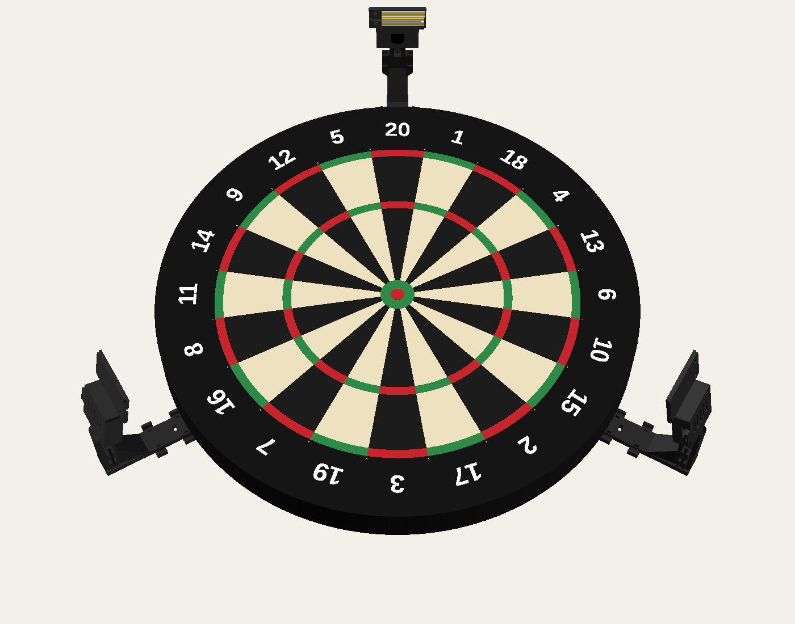
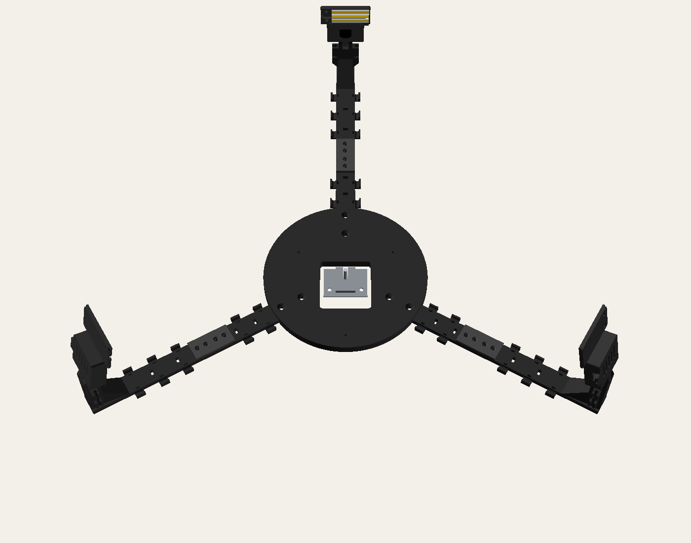

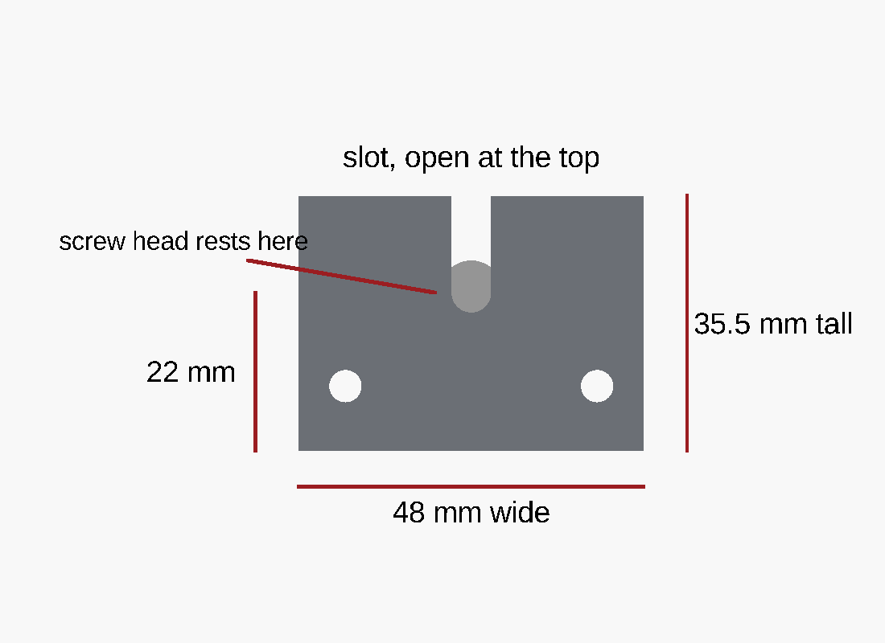 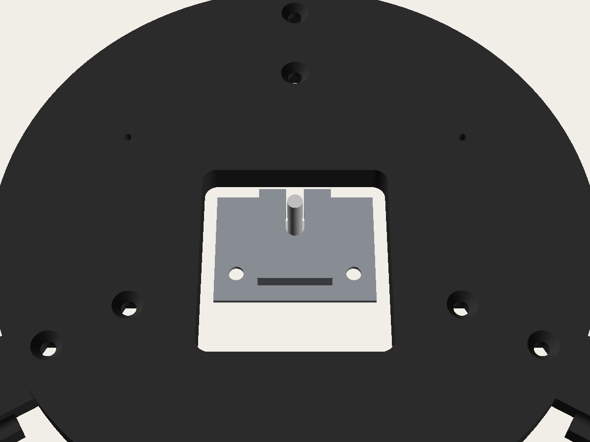

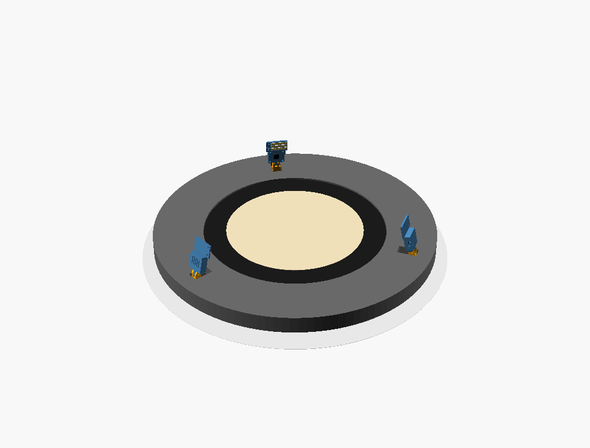 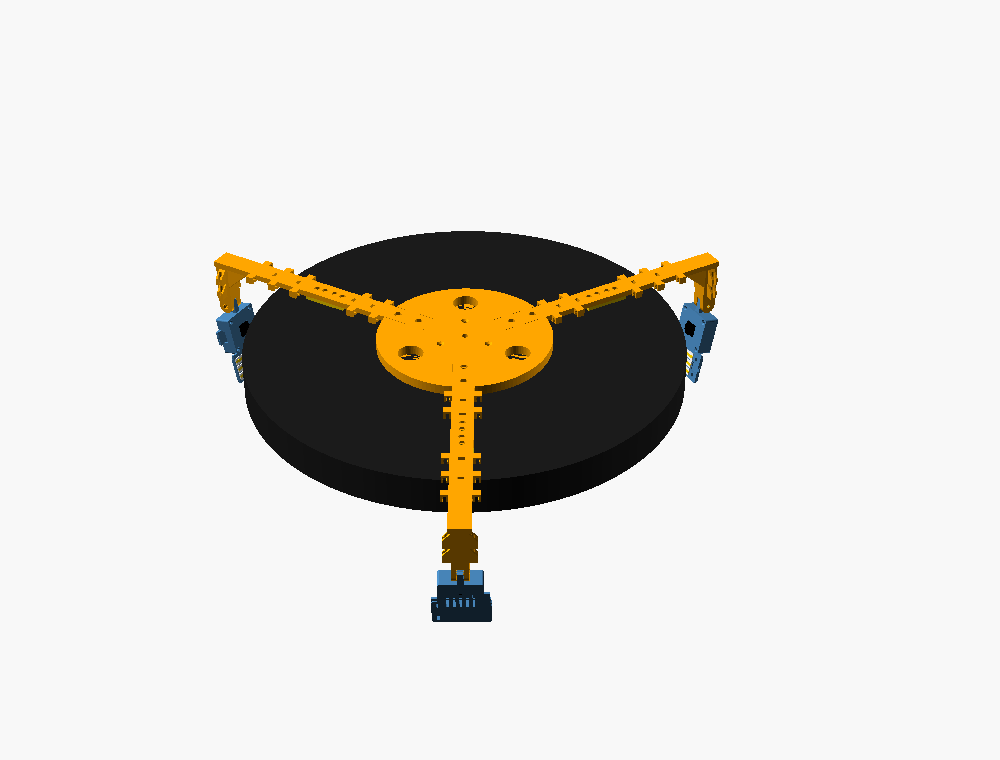

### Parts

| File | How many | Printed size | Notes |
|---|---|---|---|
| `stl/board-mount/hub.stl` | 1 | 180 × 180 × 10 mm | sits in the gap behind the board; opening in the middle for the bracket |
| `stl/board-mount/arm_inner.stl` | 3 | 125 × 35 × 6 mm | bolts into the hub; cable cradles on both sides |
| `stl/board-mount/arm_outer.stl` | 3 | 143 × 35 × 65 mm | column and tilt fork for the camera; cable cradles and clips on both sides |
| `stl/board-mount/splice.stl` | 3 | 46 × 22 × 4 mm | joins the two arm halves |
| `stl/case_tub.stl` | 3 | | back of the camera case |
| `stl/case_lid.stl` | 3 | 56 × 75 × 6.5 mm | front of the case, with the light tray above the lens |

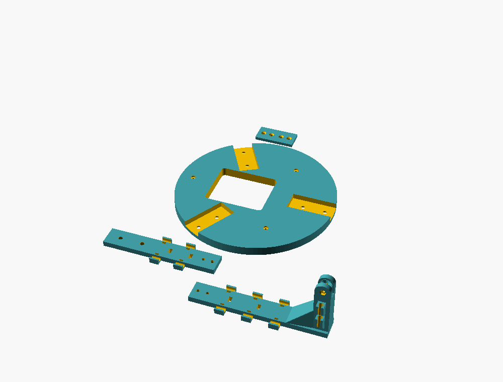

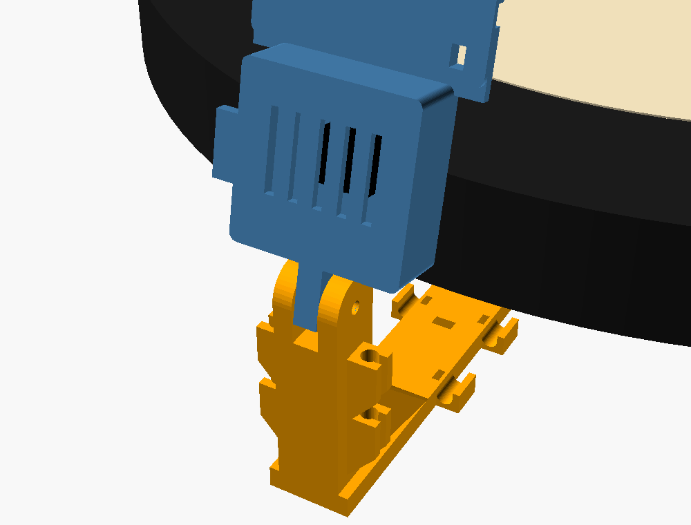

Everything fits an Ender 3 / Ender 3 SE bed (220 × 220 mm) and prints flat as exported, without supports.

**Print settings (Ender 3 SE, PETG):** see [Printing](#printing) for each part's infill and speeds. In short: PETG
(PLA slowly bends under load, and the cameras mustn't move), 0.2 mm layers, 4 walls, no supports, every part flat as
exported. Arms and splice plates 100 % infill, hub and camera cases 40 %.

### Hardware

Every bolt comes from one **950-piece M2–M5 stainless countersunk (flat-head hex socket) bolt kit**:

| Joint | From the kit | How many |
|---|---|---|
| Camera board into case | M2 × 12 (self-tap into the posts, no nuts) | 12 |
| Hub to arms | M4 × 8 + M4 nuts | 6 + 6 |
| Splice plates | M3 × 8 + M3 nuts | 12 + 12 |
| Camera tilt hinges | M3 × 20 + M3 nuts | 3 + 3 |

Use the **8 mm** bolts for the hub and splices: the wall side of the hub and arms lies flat on the wall, so nothing may
stick out of it. The nut pockets are deep enough that each nut sits right at the tip of its 8 mm bolt. The kit's lock
washers aren't needed.

Not in the kit:
- Nothing for the board itself: it keeps its own screw and wall bracket. The three small nails that held its rubber
  stabilisers go through the hub instead.
- About 35 small cable ties (up to 3.6 mm wide)
- Per light: a short piece of 5 V USB COB LED strip, 8 mm wide (see [Light](#light))

### Fitting it

1. **Measure first:** with the board hanging, the gap between its back and the wall should be 10 mm (it is on a
   Winmau bracket). If yours differs, set `hub_t` to it. Also check your wall bracket fits the hub's opening
   (56 mm wide, from 18 mm above the screw to 42 mm below it: made for the Winmau bracket, 48 × 35.5 mm with
   the bottom of its slot 22 mm up, with room for the drop as you hang the board); if not, set `bracket_w`, `bracket_above`,
   `bracket_below` and reprint the hub.
2. Take the board off the wall and pull off its three rubber stabilisers (keep the nails). **Leave the hanging screw
   exactly as it is.** The hub and arms take the stabilisers' place: they fill the 10 mm gap and rest on the wall.
3. Bolt the three inner arms into the hub's grooves (M4 × 8: heads sink into the flat side, nuts into the pockets on
   the grooved side), then the outer arms to the inner arms with a splice plate across each joint (M3 × 8, splice on
   the flat side).
4. Lay the hub on the back of the board, flat side to the board, with the screw in the middle of the opening and an
   arm pointing at 12 o'clock (so the opening's long end is below the screw). Tap the three stabiliser nails through
   the small holes into the board so the hub can't turn.
3. **Foam surround:** each column passes through the foam about 300 mm from the bull. Cut a slot about
   50 × 35 mm through the foam for each one (room for the column and its cable clips), and a shallow channel in the
   foam's back for the arm (37 mm wide, 6 mm deep).
5. Hang the board back up on its bracket as usual: the bracket goes through the hub's opening. The arms point at
   12, 4 and 8 o'clock.
6. Fit the cameras in their cases, stick the lights in their trays and hang each case in its fork with the M3 bolt.
   Then run the cables (see [Cables](#cables)).
7. In Oche's camera setup, check each camera sees the whole board, then tighten the tilt bolts and calibrate.

### Measure and adjust

At the top of `camera-mount.scad`:

- `board_t` (38): the board's thickness, front to back
- `lens_above_face` (40): how far in front of the board's face the lenses sit
- `cam_r` (300): camera distance from the bull. 300 suits the lens the OV9732 comes with (65° across: it sees
  the doubles ring with about 20 mm to spare on each side); with a
  2.1 mm lens (about 85° across) 260-280 gives a sharper view
- `hub_t` (10): the gap between the back of the board and the wall
- `bracket_w`, `bracket_above`, `bracket_below`: the opening for the wall bracket

Export a part with, for example, `openscad -D 'part="hub"' -o stl/board-mount/hub.stl camera-mount.scad`.
Parts: `hub`, `arm_inner`, `arm_outer`, `splice`, `case_tub`, `case_lid`, `wall_arm`; previews `board_assembly`,
`print_board`, `assembly`, `print_all`, `wall_view`, `wall_view_noboard`, `bracket`.

## Printing

All parts on an Ender 3 SE in PETG (matte black or dark grey is best: shiny or light plastic catches the lights and
shows up as glare in the other cameras). 0.2 mm layers, 4 walls, no supports, parts flat as exported.
Nozzle 240 °C, bed 75 °C, part fan 30-50 % and off for the first 3 layers. Gap fill everywhere.

| File | Print | Infill | Notes | Roughly |
|---|---|---|---|---|
| `stl/board-mount/hub.stl` | 1 | 40-60 % | outer brim 5 mm, so the edge can't lift | 140 g |
| `stl/board-mount/arm_inner.stl` | 3 | 100 % | | 20 g each |
| `stl/board-mount/arm_outer.stl` | 3 | 100 % | column upright; a brim helps it stay down | 50 g each |
| `stl/board-mount/splice.stl` | 3 | 100 % | | 5 g each |
| `stl/case_tub.stl` | 3 | 40 % | | 10 g each |
| `stl/case_lid.stl` | 3 | 40 % | prints face down (the light tray is on the bed side) | 10 g each |

About 450 g in all, so one 1 kg spool. In Creality Print / Orca, switch the process panel to **Objects** to give the
arms 100 % while the rest of the plate stays at 40 %.

Speeds: first layer 20 mm/s, outer wall 40, inner wall 60, infill 80, top surface 40, gap fill 30 (if your slicer
shows it), travel 150. Slower than the printer can go, on purpose: PETG's layers bond better.

## Light

The lid has a tray above the lens with three 8 mm grooves, for pieces of **5 V USB COB LED strip** (the 320 LEDs/m
kind, natural white). Choose the plain "USB" version or one with an on/off switch, **never a dimmer or touch dimmer**:
dimmers flicker too fast for your eye but not for the camera, which sees moving bands.

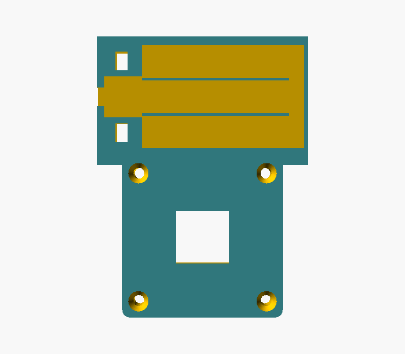

- **One piece per camera:** cut the strip on its marked copper pads so the piece with the USB lead is at most 43 mm
  long. Stick it in the **middle groove** with its own adhesive, USB end towards the pocket. The lump where the lead
  joins sits in the pocket, and the lead leaves through the notch.
- **Brighter (three pieces):** stick two more 43 mm pieces in the outer grooves, all facing the same way, and join
  them at the far end with short wires (+ to +, − to −); there's a channel across the ends for them.
- Tie the lead down through the two slots beside the pocket, so a tug on the cable can't pull the strip off.
- Power the lights from a powered USB hub or a USB charger, not from the Mac directly.

## Cables

Each camera has two USB-A cables: the camera's own cable, which leaves the case on one side, and the light's lead,
which leaves the tray on the other. On the board mount each runs down its own side:

- **Column:** two snap-in clips on each side. They open sideways, so push the cable in from the side.
- **Arms:** open cradles along each side (three on the outer arm, two on the inner). Lay the cable in and hold it
  with a small cable tie through the slot in the arm beside each cradle: down through the slot, under the arm and
  cradle, up the outside and over the cable. (The arm cradles have no snap-in lips on purpose: the arms print flat,
  so lips would bend across the layer lines and snap.)

The USB plugs never have to go through anything. Leave a small loop between the case and the first clip so the camera
can still tilt. At the hub, bring all six cables together behind the board and down to the USB hub.

The clips and cradles fit cables up to about 4.4 mm thick (`cable_d`).

## Mini model (1:4, to try it out)

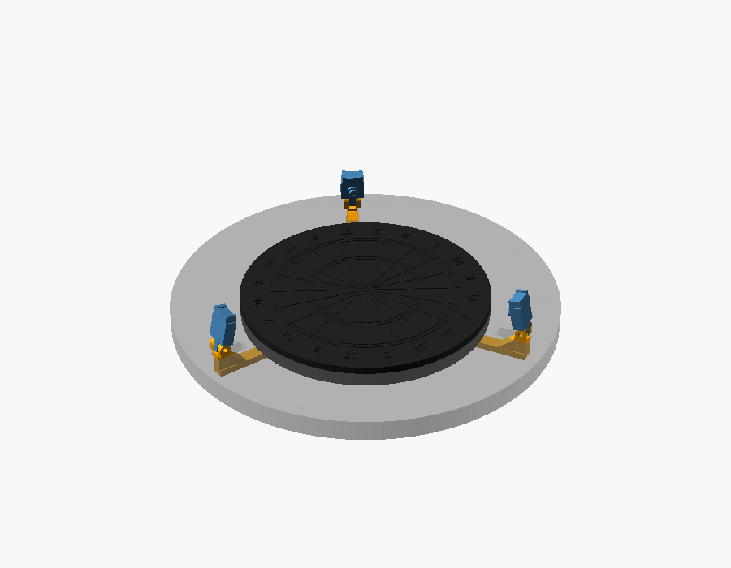

A desk-sized version of the board mount, to look at and tinker with before printing the real thing
(`mini-model.scad`, STLs in `stl/mini/`). Simplified so it prints well: no screws, the board sits on a peg in the middle
of the frame and turns on it, and each camera tilts on a hinge pin cut from 1.75 mm filament.

| File | How many | Size | Rough print time (Ender 3 SE) |
|---|---|---|---|
| `mini_board.stl` | 1 | 113 mm across | 1.5-2 h (0.12-0.16 mm layers for crisp numbers) |
| `mini_frame.stl` | 1 | 120 × 138 mm | about 1 h |
| `mini_camera.stl` | 3 | 11 × 20 mm | about 15 min each |
| `mini_surround.stl` | 1, optional | 175 mm across | 2-3 h |

PLA is fine, 3 walls, 20 % infill, no supports. To put it together: push the board onto the frame's peg, cut three
short pieces of filament, push each through a fork and its camera's hinge tongue, and tilt the cameras towards the
board. If a pin is loose, change `pin_d` to 1.85 and reprint the camera. The engraved rings and raised numbers make
the board easy to paint.

## Wall mount

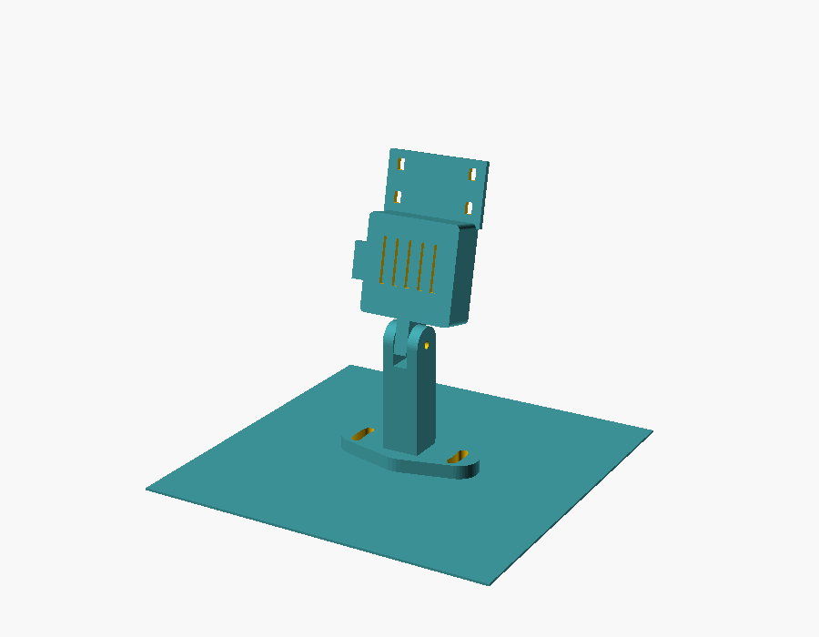

`stl/wall-mount/wall_arm.stl` plus the same camera case. Screw each arm to the wall 300 mm from the bull (evenly
spaced), with the arrow on the plate pointing at the bull; the curved slots let it turn 12° either way. Set
`board_face_from_wall` to how far your board's face sits out from the wall. Hardware per arm: the camera and tilt
parts above, plus 2 pan-head wood screws with washers and wall plugs.

## Camera case assembly

1. Focus the lens first (turn it until the board is sharp at about 30 cm), then put the board in the case with its
   USB connector towards the cable slot.
2. Lid on, 4 × M2 × 12 countersunk screws through the lid and board into the posts. Snug, not tight: they cut
   their own thread in the plastic.
3. Stick the LED strip in the lid's light tray (see [Light](#light)).
4. Hang the case in the fork with the M3 bolt; the teeth hold the tilt once it's tight.
5. Cable-tie the camera cable to the anchor under the case's cable slot.
